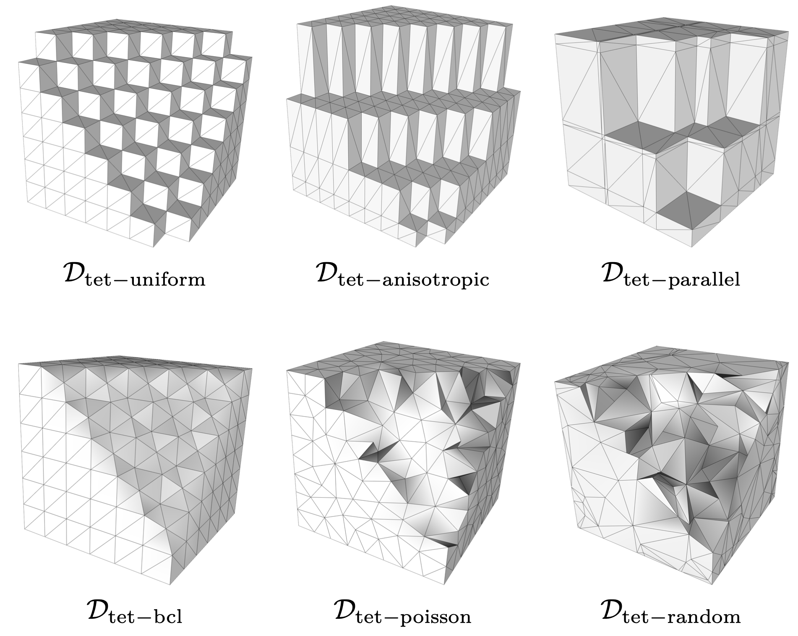
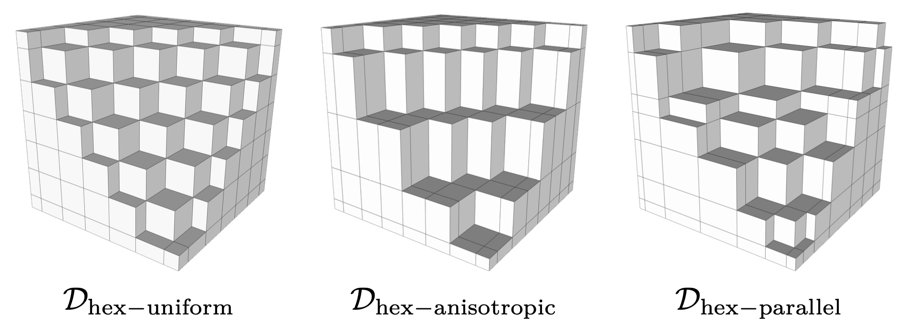
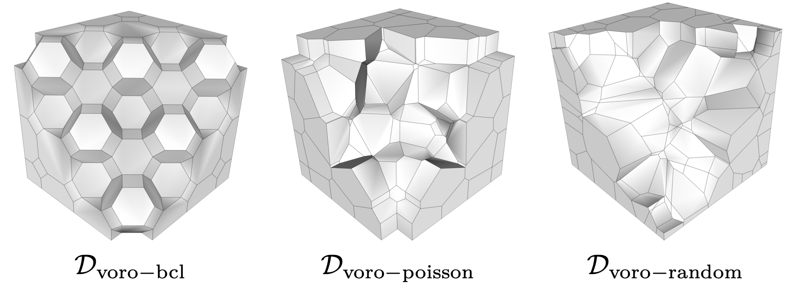

# vem-3D-quality-dataset
Datasets used for "A quality indicator for polyhedral meshes in the Virtual Element Method" by T. Sorgente, S. Biasotti, G. Manzini and M. Spagnuolo.
These datasets have been created within the mesh generation framework presented in the Section 4 of the paper.

The repository contains six **tetrahedral datasets**:

<p align="center"></p>

three **hexahedral datasets**:

<p align="center"></p>

three **Voronoi datasets**:

<p align="center"></p>

and three **polyhedral datasets**, which derive from the tetrahedral datasets but have some elements (20%) merged to form non-convex polyehdra.

## Content

Each .zip file contains a dataset made of five meshes with decreasing mesh size; some of them are divided in two parts due to the file size limitations of github.

Each mesh is saved in the REGN_FACE format, which consists in a .node file, containing informations on the vertices:

_vertex id____x-coord____y-coord____z-coord_

and a .ele file, containing informations about the elements with the following structure:

_element id____n. of faces_

_______face id____n. of face verts____face verts ids_

_______face id____n. of face verts____face verts ids_

_______face id____n. of face verts____face verts ids_

...

## Citing us
If you use one or more datasets in your academic projects, please consider citing the original paper using the following BibTeX entry:

```
@article{sorgente2022polyhedral,
  title={Polyhedral mesh quality indicator for the Virtual Element Method},
  author={Sorgente, Tommaso and Biasotti, Silvia and Manzini, Gianmarco and Spagnuolo, Michela},
  journal={Computers \& Mathematics with Applications},
  volume={114},
  pages={151--160},
  year={2022},
  publisher={Elsevier}
}
```

## Acknowldegment
This research has been supported bt the ERC Project CHANGE (https://cordis.europa.eu/project/id/694515), which has received funding from the European Research Council (ERC) under the European Union’s Horizon 2020 research and innovation programme (grant agreement No 694515).
